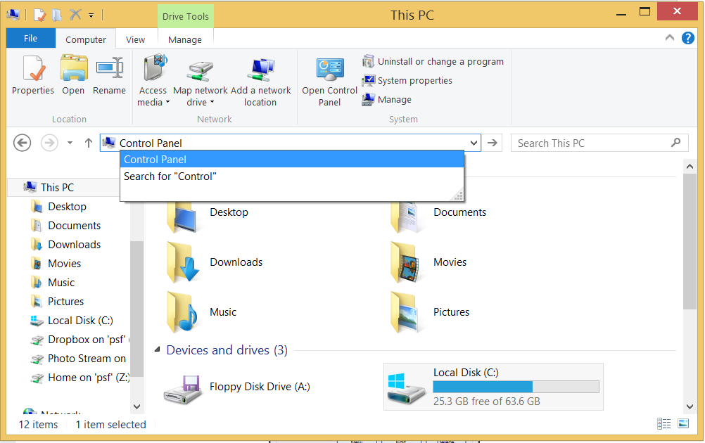
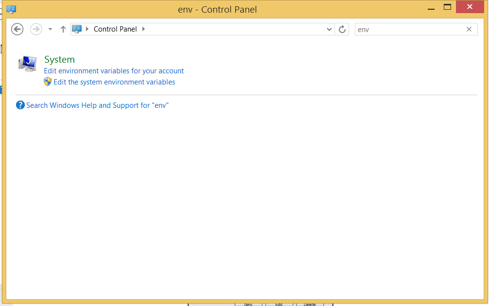
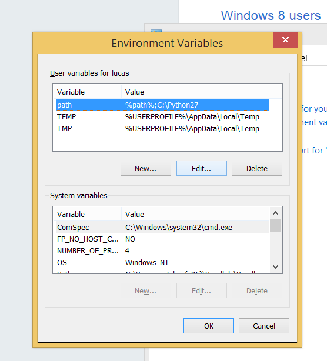

# Setup

## Mac OS Setup

### 1. Install XCode Developer Tools

```
xcode-select --install
```

Note: You should not need the full [XCode](https://itunes.apple.com/us/app/xcode/id497799835?mt=12).


### 2. Install Homebrew

[Homebrew](http://brew.sh/) is a package manager for macOS.

Please follow the installation instructions at http://brew.sh/

### 3. Install python, node.js, and npm

To install ``node-version-manager``, please follow:

https://github.com/creationix/nvm#install-script

Python may be required for working with some projects, though macOS has it built in. Installing node.js will provide you with the `node` and `npm` commands.

```
# brew install nvm;  # Note: nvm discourages installation by brew
nvm install 6.3.1;
nvm alias default 6.3.1;
```

## 4. Setup git and GitHub

See [Setting up Git][git-setup]
on GitHub's website for instructions to get started with git and GitHub.


## Windows Setup

## 1. Install Visual Studio 2013 or higher

You can download the [community edition for free](http://www.visualstudio.com/products/visual-studio-community-vs).

## 2. Install Python

Python may be required for working with some projects so just [download and run the installer](http://www.python.org/download/releases/2.7/).

## 3. Install node.js

[Download and run the installer][node-download] to get `node` and `npm`.

## 4. Setup git and GitHub

See [Setting up Git][git-setup] on GitHub's website for instructions to get started with git and GitHub.

Install [psget](http://psget.net/)

```
Host github.com
  User git
  Port 22
  Hostname github.com
  IdentityFile ~/.ssh/id_rsa
  TCPKeepAlive yes
  IdentitiesOnly yes
  ForwardAgent yes
```

## 5. Update environment variables

1. Open a new Explorer window and search for `Control Panel`:
  
2. In `Control Panel`, search for `env` to find the `Edit environment
  variables for your account` link:
  
3. Click on the `path` row and then click `Edit`:
  
4. Paste the below in `Variable Value` text field and click `OK`:

  ```
  %path%;C:\Python27;C:\Program Files (x86)\Git\bin;%USERPROFILE%\AppData\Roaming\npm;
  ```
5. Click the `New` button to create a new `HOME` environment variable with
  the value `` and click `OK`:
  
6. Click `OK` again to close the `Environment Variables` dialog
7. Open `PowerShell` and run the below to verify everything is working correctly!

  ```
  ssh -T git@github.com
  ```

> @todo: instructions for using windows via Parallels.

## Linux Setup

## 1. Install dependencies

```
sudo apt-get install build-essential clang libdbus-1-dev libgtk2.0-dev \
                       libnotify-dev libgnome-keyring-dev libgconf2-dev \
                       libasound2-dev libcap-dev libcups2-dev libxtst-dev \
                       libxss1 gcc-multilib g++-multilib
```

## 2. Install node.js and npm

Check [this article][install-linux] on how to install
a current version of node.js. (Note: the article is also linked from
[node's wiki page][node-wiki-install].)

## 3. Setup git and GitHub

See [Setting up Git][git-setup]
on GitHub's website for instructions to get started with git and GitHub.


[install-linux]: https://nodesource.com/blog/nodejs-v012-iojs-and-the-nodesource-linux-repositories
[node-download]: https://nodejs.org/download/
[node-wiki-install]: https://github.com/joyent/node/wiki/Installing-Node.js-via-package-manager
[git-setup]: https://help.github.com/articles/set-up-git/#setting-up-git
<<<<<<< Updated upstream
=======
[gitter-mongodb-js]: https://gitter.im/mongodb-js/mongodb-js
[windows-environment-variables]: https://www.microsoft.com/resources/documentation/windows/xp/all/proddocs/en-us/sysdm_advancd_environmnt_addchange_variable.mspx?mfr=true
>>>>>>> Stashed changes
